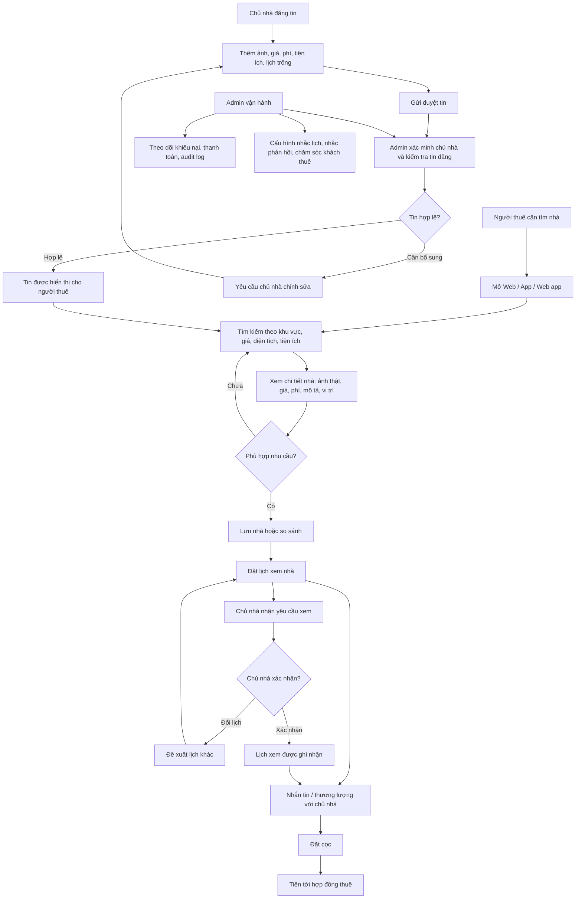

# RentCity

RentCity là nền tảng tìm trọ, thuê nhà và quản lý nhà cho thuê. Sản phẩm hướng tới việc làm cho quá trình thuê nhà minh bạch hơn: người thuê xem được thông tin rõ ràng, chủ nhà quản lý được khách và lịch hẹn, còn đội vận hành có công cụ kiểm duyệt riêng.

## Mục Đích

RentCity tập trung giải quyết ba vấn đề chính:

- Người thuê cần tìm được nhà thật, giá thật, ảnh thật, vị trí rõ và còn lịch xem.
- Chủ nhà cần quản lý tin đăng, khách quan tâm, lịch xem, thương lượng, cọc và hợp đồng.
- Đội RentCity cần kiểm duyệt tin, xác minh chủ nhà, theo dõi chất lượng và xử lý các tình huống phát sinh.

Mục tiêu cuối cùng là gom hành trình thuê nhà vào một luồng liền mạch: tìm nhà, xem chi tiết, lưu nhà, đặt lịch, nhắn tin, đặt cọc và tiến tới hợp đồng.

## Người Dùng Chính

- Người thuê: tìm trọ, thuê căn hộ, lưu nhà, đặt lịch xem, nhắn tin và theo dõi lịch hẹn.
- Chủ nhà: đăng tin, quản lý nhà cho thuê, phản hồi khách, theo dõi lịch xem và xử lý cọc/hợp đồng.
- Admin RentCity: xác minh chủ nhà, duyệt tin, kiểm tra chất lượng, xử lý khiếu nại và quản lý vận hành.

## Cách RentCity Hoạt Động

RentCity được chia thành các bề mặt sử dụng riêng:

- Web: website desktop cho người thuê tìm kiếm, xem chi tiết và đặt lịch.
- App: giao diện mobile app cho người thuê sử dụng thường xuyên.
- Web app: bản chạy trên trình duyệt điện thoại/PWA cho người không cài app.
- Admin: hệ thống nội bộ cho đội RentCity, tách riêng với phần quản lý nhà thông thường.

Ở nhánh `develop`, RentCity là bản tích hợp gồm frontend React, backend NestJS và bộ E2E Playwright. Frontend vẫn giữ fallback mock/local state để trải nghiệm giao diện khi backend chưa bật, nhưng các luồng chính đã có service/API boundary để kiểm thử full-stack.

```text
front-end/                 Giao diện web, app mobile-style, phone web app/PWA và admin console
back-end/                  API NestJS, Prisma schema, migrations, seed data và docs backend
e2e/                       Playwright tests cho các luồng chính
.github/workflows/         CI chạy frontend, backend và full-stack E2E
```

Local full-stack setup lives in `docs/local-development.md`.
Production deployment notes live in `docs/production-deployment.md`.

## Workflow



## Các Phần Sản Phẩm

- Tìm kiếm nhà theo khu vực, giá, diện tích và tiện ích.
- Xem chi tiết nhà với ảnh thật, mô tả, phí, lịch trống và bản đồ.
- Lưu nhà, so sánh nhanh và quản lý danh sách quan tâm.
- Đặt lịch xem nhà và theo dõi trạng thái lịch hẹn.
- Nhắn tin giữa người thuê, chủ nhà và hỗ trợ.
- Quản lý cọc, thanh toán và hợp đồng ở mức giao diện.
- Chủ nhà quản lý tin đăng, khách quan tâm và lịch xem.
- Admin duyệt tin, xác minh chủ nhà, xử lý khiếu nại và theo dõi vận hành.

## CI

GitHub Actions tự phát hiện workspace trong repo:

- Có `front-end/package.json` thì chạy frontend quality gate.
- Có `back-end/package.json` thì chạy backend quality gate với Postgres và Redis.
- Có đủ frontend, backend và Playwright config thì chạy full-stack E2E.
